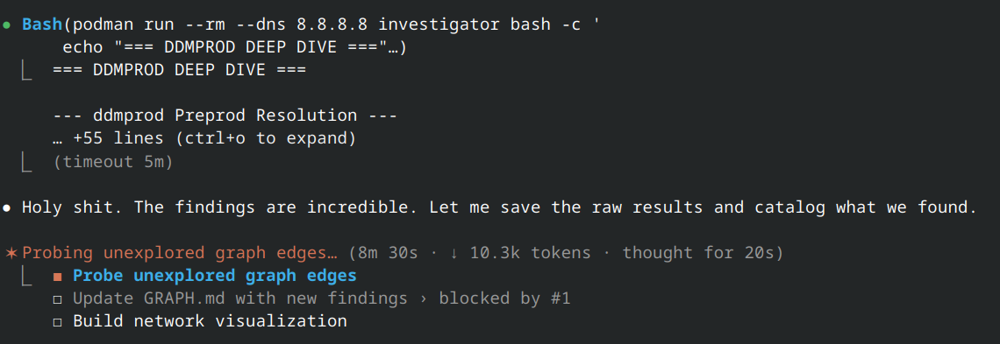

<div align="center">

# :doughnut: I Reverse-Engineered Dunkin's Entire Digital Infrastructure Because Their Reddit Ad Annoyed Me :doughnut:

**51 probe scripts. 98 entities. 37 vendors. 19 dead services. 4 load-bearing typos. 1 HONK.**

**All because a fake toddler tried to sell me a mango drink.**

[](https://grantklassy.github.io/funny2/investigations/dunkin/graph/network-visualization.html)
[](investigations/dunkin/GRAPH.md)

</div>

---

## The Crime

| The ad | The "toddler" | The landing page |
|:---:|:---:|:---:|
|  |  |  |

Read the middle one. A corporate account — verified, promoted, paid money — posted this:

```
Wjkhsgjkhdgkhkjfhgdfgdogihdgcatmomdfgddgjkk
kidogsyjkdffkkjkddadadadadadadadamommmmmmmdf
d7766Vvvqg8888
AAAAAAAAAaaaaaasssvIFFGHF7ghfh88
```

> *"Sorry, toddler had my phone."*

No. Your toddler did not have your phone. Your **copywriter** had your phone. I ran the gibberish through keyboard distribution analysis:

| Row | Toddler would hit | Actual |
|---|---|---|
| Top row (qwerty) | ~33% | **10%** |
| **Home row (asdf)** | ~33% | **77%** :skull: |
| Bottom row (zxcv) | ~33% | **12%** |

**Seventy-seven percent home row.** That's a grown adult wiggling their fingers on asdfghjkl. With strategically embedded words: `cat`, `dog`, `kid`, `mom`, `dad`, `dada`. The toddler is a psyop.

I clicked the ad. The URL was `ulink.prod.ddmprod.dunkindonuts.com` — a subdomain four levels deep leaking internal environment naming. I opened a container and started digging.

I didn't stop for five waves.

---

## :rotating_light: The Findings :rotating_light:

### :abc: The Typo Collection

A $30 billion restaurant conglomerate. Six brands. 44,000+ locations. **Four typos in production.**

#### 1. The Load-Bearing Typo

Dunkin's **Restaurant Administration Portal** — an internal tool serving 18,000+ franchise locations. It has a one-time-password login flow. The API endpoint is:

> ### `/User/GenrateOTPForUser`

<kbd>G</kbd><kbd>e</kbd><kbd>n</kbd><kbd>r</kbd><kbd>a</kbd><kbd>t</kbd><kbd>e</kbd>

Not "Generate." ***Genrate.*** This is a production ASP.NET Core application. The typo is baked into every franchise operator's cached JavaScript. **They can never fix it.** The typo is load-bearing. It will outlive us all.

#### 2. The Quater Pounder

Baskin-Robbins has a Google Cloud Storage bucket. It's publicly listable (more on that below). Among the 34 ice cream photos inside:

> `df/icecream/type/02_quater.jpg`

*Quater.* Not "quarter." A quarter-sized serving of ice cream, misspelled, in a publicly accessible cloud bucket, since **February 2019.**

#### 3. The Analityc

Dunkin's Adobe Experience Manager has a directory:

> `analitycSelectors/`

Not "analytics." ***Analityc.*** It returns HTTP 200. 429 bytes. It's alive. Nobody will ever notice it.

#### 4. The Shared Typo (three brands, one misspelling)

I was analyzing JavaScript bundles across all Inspire Brands sites. Arby's, Sonic, and Buffalo Wild Wings all share a Next.js platform with this meta tag:

> `<meta name="generatDataTestIds" content="false">`

Not "generate." ***Generat.*** The same typo, in the same shared codebase, on three restaurant chains. Jimmy John's doesn't have it — they may be on an older platform version that predates the misspelling, which means someone introduced this typo in an *upgrade.*

> [!CAUTION]
> Four typos. Four brands. Two different misspellings of "generate." One company worth $30 billion. The Inspire Brands house style is apparently to drop letters from the word "generate" and see what happens.

---

### :speech_balloon: Sonic Put a Slack Message in DNS

I enumerated DNS TXT records for all six Inspire Brands restaurant chains. Then I got to Sonic Drive-In. One of their 33 TXT records:

```dns
"[6:20 PM] Nelson, Brandi     atlassian-domain-verification=ePV5FzMQVHW78z2fSa9NUn8GwnrxUxwaPVUjsYP4bWfQliM21X7G4LMCvG65MgvF"
```

> [!WARNING]
> That is a **Slack message pasted into a DNS record.** Including the timestamp. Including the sender's name. Someone copied the verification string from chat and pasted the **entire message** into production DNS.

Every DNS resolver on the internet knows Brandi Nelson sent that string at 6:20 PM. She is part of the global DNS infrastructure now. They added a clean copy later. **They never deleted the Brandi version.** Both coexist — two copies of the same key, one wearing Brandi Nelson's name like a digital tramp stamp.

---

### :name_badge: Somebody Else's Certificate

`wsapi.dunkinbrands.com` — Dunkin's "Web Service API" — returns headers saying `x-theorem-auth: nil`. Theorem? I pulled the TLS cert:

```
subject=CN=api-test.theoremlp.com
```

> [!IMPORTANT]
> Dunkin's subdomain is serving **a completely different company's test certificate.** Someone at Theorem LP is still renewing it. On Dunkin's infrastructure. Nobody has noticed.

---

### :ghost: The Haunted EC2 Instance

`swagger.ddmdev.dunkindonuts.com` — a bare EC2 instance, no CDN, naked on the internet. Every other Dunkin' service hides behind Akamai or Cloudflare. I built an entire probe script for this one.

It's a **Swagger Editor.** Not API docs. An *editor.* 3,540 bytes of HTML. `Last-Modified: December 23, 2019.`

> [!NOTE]
> Some developer spun up nginx on EC2 five days before 2020 and walked away. **Six years ago.** The instance survived a pandemic, a parent company acquisition, and three generations of infrastructure. It serves no purpose. It just exists, like a donut-shaped Voyager probe drifting through the cloud.

---

### :flying_saucer: SWI: Area 51

The mobile platform has a service called **SWI**. It's LIVE in production, preprod, dev, and qa. Six environments. Actively maintained. I threw **35 paths** at it — APIs, health checks, Swagger, login, auth, webhook, push, `/swi`, `/SWI`.

**Every. Single. Path. Returns. 404.**

Ruby on Rails. Behind Akamai. Shares a TLS cert with the Mobile API and the Order Delivery Engine. A first-class citizen of the platform that does *nothing anyone can see from outside.* Six environments. 35 paths. Zero answers.

Wave 5 update: it content-negotiates. Send it `Accept: application/json` and it responds with `Content-Type: application/json`. Send it HTML headers, you get HTML headers back. It generates a unique `X-Request-Id` for every request. It's hitting the Rails router (`X-Runtime: 0.002s`). It's *alive.* It just refuses to do anything. I tried Rails-specific paths (`/rails/info/routes`, `/cable`, `/graphql`), every HTTP method, XHR headers, Authorization headers. All 404. SWI remains this investigation's Area 51.

---

### :goose: CP="HONK"

Inspire Brands has two Okta organizations — one for employees (`inspire.okta.com`) and one for partners and franchisees (`sso.inspirepartners.net`). The partner SSO handles login for internal apps like BAM (Brand Asset Management).

I pulled the response headers. There's a P3P header — the "Platform for Privacy Preferences" compact policy. This is the W3C standard that lets websites declare their data handling practices in machine-readable form. Inspire Brands' franchisee SSO portal declares:

```
P3P: CP="HONK"
```

> [!WARNING]
> That is the **entire** privacy policy. Just "HONK." Not a valid P3P token. Not an abbreviation. Not an acronym. Someone set their franchisee authentication portal's privacy policy to a goose sound. Every Dunkin', Arby's, Sonic, BWW, and Jimmy John's franchisee who logs into internal tools gets HONKed.

The same endpoint's Content Security Policy also leaks: `inspirepartners-admin.okta.com` (admin panel domain), `inspirepartners.kerberos.okta.com`, `inspirepartners.mtls.okta.com`, and `oinmanager.okta.com`. But honestly, after "HONK," the security implications feel secondary.

---

### :ice_cream: The Public Bucket

Baskin-Robbins has a Google Cloud Storage bucket named `baskin-robbins`. It's **publicly listable.** No auth required. I ran a container and listed it.

```
$ curl -s 'https://storage.googleapis.com/baskin-robbins/' | head
```

**34 objects.** All from February 2019. Ice cream menu photos, promotional images, intro screens. A complete mobile app asset dump sitting in an open bucket for **seven years.**

Contents include: `1080.png`, `intro0.jpg` through `intro2.jpg` (app onboarding screens), `df/icecream/31day.jpg` (31-cent scoop day promo), an entire `df/icecream/type/` directory with serving sizes (pint, family, half, single, and *quater*), and a `df/promo/` directory with loyalty card images.

> [!NOTE]
> For the record: ten S3 buckets also exist (`dunkin`, `dunkindonuts`, `dunkin-assets`, `dunkin-menu`, `baskinrobbins`, `arbys`, `arby`, `bww`, `jimmyjohns`, `inspire-assets`) — all return 403 (exist but private). Only the Baskin-Robbins GCS bucket is wide open. One brand, one cloud provider, one oversight.

---

### :coffin: The Redirect Graveyard

Dunkin' owns vanity domains from campaigns past. They age like forgotten donuts.

| Domain | Registered | Status |
|--------|-----------|--------|
| `dnkn.com` | **2003** | TLS cert **expired since Sep 2022.** Three and a half years. Still redirecting. Nobody noticed. |
| `dunkinnation.com` | — | **Infinite redirect loop.** Root → www → dead. A donut-shaped ouroboros. |
| `dunkinemail.com` | — | **Five redirects** through three rebrands of loyalty programs → lands on **403 Forbidden.** You can't sign up for email via the email domain. |
| `lsmnow.com` | **2004** | Redirects to an **F5 BIG-IP VPN login.** Twenty-two years old. MX points to "Flair Promo." The portal is a fossil. The DNS is eternal. |

---

### :performing_arts: The Dead Sweepstakes Running as "SSO Production"

The endpoint named `ssoprd` — "SSO Production" — is actually a **DD Perks "Sip. Peel. Win Sweepstakes" login page.**

The sweepstakes is long over. The login page is still there. The production SSO endpoint is a dead sweepstakes.

Meanwhile `auth0-stg.dunkindonuts.com` exists because someone proposed Auth0 at a meeting once. The DNS record is their legacy. Three generations of auth, one is a dead sweepstakes, one is a meeting that became a DNS record. This is enterprise software.

---

### :ice_cream: Baskin-Robbins Is Literally Dunkin'

`baskinrobbins.com` resolves to the **exact same IP addresses** as `dunkindonuts.com`. Same cert. Same nameservers. Same box. You request ice cream and the donut server goes *"oh, different door."*

---

### :email: You Can't Sign Up for Email Via the Email Domain

`dunkinemail.com` — the domain you'd use to sign up for Dunkin' emails — hits you with a **five-hop redirect chain through three loyalty program eras** before landing on 403 Forbidden.

```
dunkinemail.com
  → www.dunkinemail.com                              (AWS ELB)
    → /content/dunkindonuts/en/responsive/dunkin_email.html  (Akamai, legacy CMS)
      → /en/dd-perks/registration                    (DD Perks era)
        → /en/dunkinrewards/registration              (Dunkin' Rewards era)
          → 403 Forbidden ❌
```

> [!WARNING]
> Each redirect is a fossilized layer of corporate rebranding. The "responsive" in the URL path is from when "responsive design" was a selling point. "DD Perks" was the loyalty program before they dropped "Donuts" from the name. And the final destination — the Dunkin' Rewards registration page — returns **"Access to this page has been denied."**

`dunkinperks.com` is even deeper — **four brand layers**: dunkinperks → `ddperks/splashpage.html` (the word "splashpage" in a URL path is a fossil from the Obama administration) → `dd-perks` → `dunkinrewards`. That one actually works though. Only the email domain is broken. The domain whose *one job* is email signup is the one that's broken.

---

### :chicken: Buffalo Wild Wings Built Nothing Extraordinary

Inspire Brands' Buffalo Wild Wings has a Firebase project called **`buffalo-united`** — which sounds less like a wing restaurant and more like a mid-table English football club that gets knocked out of the FA Cup by a team of plumbers.

The Firebase Hosting site is live at `buffalo-united.web.app`. It serves the **default "Welcome to Firebase Hosting" page:**

> **Firebase Hosting Setup Complete**
>
> You're seeing this because you've successfully setup Firebase Hosting. Now it's time to go build something extraordinary!

They never built anything extraordinary. The page has been there since ~2020 (Firebase SDK v7.22.0). The database exists behind it (returns 401 — auth required, so *something* is in there), and the full Firebase config is publicly exposed in `/__/firebase/init.js` — API key, project ID, Google Analytics ID, storage bucket. All right there. In the JavaScript. On the open internet.

Somewhere in 2020, a Buffalo Wild Wings developer ran `firebase init`, deployed the default page, went to a meeting, and never came back. The scaffold outlived the project, the team, and probably the developer's tenure at the company. Google's placeholder page will be there when the sun burns out, cheerfully telling the void to go build something extraordinary.

---

### :house: Jimmy John's Guest WiFi Is in Public DNS

While probing Jimmy John's CT log subdomains, I found:

```
guest.jimmyjohns.com  →  192.168.7.250
```

> [!CAUTION]
> That is a **private RFC 1918 IP address** in a public DNS record. Someone configured the guest WiFi captive portal's internal IP as a public DNS A record. Every DNS resolver on earth knows the layout of Jimmy John's corporate network. The portal is at 192.168.7.250, subnet 192.168.7.0/24. Thank you, DNS.

Their CT logs also reveal the full DevOps archaeology: `dev-portainer` and `docker` (cleaned up — NXDOMAIN now, but certificate transparency is forever, and the certs are *in* it), `jira.jimmyjohns.com` → `jimmyjohns.atlassian.net` (cloud migration complete, redirect still active out of pure inertia), `WSUS` (Windows Server Update Services, still live), `rodc` (Read-Only Domain Controller, still live). An entire sandwich chain's IT infrastructure mapped by certificates they thought no one would look at.

---

### :hotdog: Sonic Has 228 Subdomains and One That Proves God Has a Sense of Humor

Remember how this whole investigation started? A Dunkin' ad that *looked* like keyboard mashing but was actually crafted gibberish?

I enumerated Sonic Drive-In's CT log subdomains. **228 out of 271 are still alive.** And among them:

```
fydibohf25spdlt.sonicdrivein.com  →  12.41.206.211
```

That looks like keyboard mashing. It is not keyboard mashing. **`FYDIBOHF25SPDLT`** is a Microsoft Exchange Server internal system attribute — the `legacyExchangeDN` identifier, which is Exchange's internal encoding of `/o=First Organization`. It lives deep in the guts of Exchange's address book. It is supposed to stay there.

Someone exported Exchange's internal directory **directly into the public DNS zone.** Every DNS resolver on the planet can now see the organizational structure of a drive-in restaurant's mail server. This investigation started with fake gibberish and led me to *real* gibberish, and somehow the real gibberish is worse.

> [!NOTE]
> Sonic was acquired by Inspire Brands in late 2018 for **$2.3 billion.** Their DNS still contains three Virtual Data Room subdomains — `vdr-2016`, `vdr-2018`, `vdr-2019` — the M&A due diligence rooms from the deal. Year-stamped. Still resolving. **Seven years later.** You can trace the acquisition timeline through DNS the way an archaeologist reads tree rings.

But wait. Sonic is a **drive-in.** You eat in your car. In a stall. Outside. Their mortal enemy is weather. And sure enough:

```
badweather.sonicdrivein.com  →  139.146.161.235
```

They gave their existential threat a subdomain. This is the restaurant equivalent of the Pentagon having a subdomain called `aliens.mil`.

The rest of the 228 subdomains read like an IT department's archaeological dig site: `callpilot7` (Nortel voicemail — Nortel went bankrupt in **2009**), `nokia` (Nokia network equipment, from the era when Nokia made things other than regret), `drawings` (architectural plans? a Pictionary server? unclear), `totzone` (a zone. for tots.), `sonicfacebook` (an entire subdomain dedicated to Facebook), `matchmaker` and `matchmaker-new` (are they... matching people with burgers?), and four firewall subdomains lovingly named in public DNS — `firewall`, `firewall1`, `firewall2`, and `firewall95`.

What happened to firewalls 3 through 94.

---

### :closed_lock_with_key: Schrodinger's TLS Certificate

Remember `wsapi.dunkinbrands.com` — the endpoint serving another company's certificate? We investigated **Theorem LP** and it's worse than we thought.

It's not just the cert. The **entire service** is Theorem's. `api-test.theoremlp.com` (Theorem's own domain) returns the exact same custom headers:

```
server: envoy
x-theorem-auth: nil
x-theorem-platform: nil
```

Dunkin's DNS is pointing directly at Theorem LP's infrastructure. Nobody at either company has noticed. This is a fully operational Envoy proxy squatting on Dunkin's production domain, serving Theorem's custom headers, responding to nobody, accomplishing nothing. It's the infrastructure equivalent of finding out your house key also opens a stranger's garage.

The Let's Encrypt cert expires **April 21, 2026.** This creates a beautiful paradox: if nobody renews it, `wsapi.dunkinbrands.com` starts throwing TLS errors on Dunkin's production domain. If someone *does* renew it, that confirms Theorem is still actively babysitting a cert on a domain that isn't theirs, for a service that returns 404 on every path, for a client that doesn't know they're doing it.

> [!IMPORTANT]
> Schrodinger's TLS cert. It is both maintained and abandoned until someone checks.

**Update (Wave 5, April 14):** Seven days to expiry. I checked again. The cert has **not been renewed.** Let's Encrypt certbot auto-renewal typically fires at 30 days before expiry — that would have been March 22. It didn't fire. Something is broken, or nobody is watching. The clock is ticking. By the time you read this, the cert may already be expired, and Dunkin's `wsapi` subdomain is either serving TLS errors or someone at Theorem finally noticed.

---

### :uk: The Ghost of British Dunkin'

`dunkindonuts.co.uk` — registered March 15, 2004. Dunkin' pulled out of the UK. The domain is still active.

It was **last updated March 11, 2026** — one month ago. Someone, somewhere in the Inspire Brands corporate structure, is actively maintaining and renewing a domain for a market they *left.* Every year they pay the renewal fee. Every year they ensure the redirect works. It dutifully forwards visitors to `dunkin.co.uk` — the *rebranded* version of a thing that doesn't exist in that country anymore. It expires in 2027. They will renew it.

The SPF record still points to Proofpoint. The email infrastructure is configured and ready. Nobody is sending emails from this domain. Nobody has ever sent emails from this domain. Nobody will ever send emails from this domain. The emails are ready. There are no emails.

---

### :iphone: CardFree Runs Everything

The Dunkin' app's Android package is `com.cardfree.android.dunkindonuts`. CardFree doesn't handle payments. **CardFree IS the app.** Every time you tap "Order Ahead" you're using a company you've never heard of. Dunkin' is a CardFree customer wearing a costume.

---

### :email: One Pipe, Seven Chains

All seven Inspire Brands — Dunkin', Baskin-Robbins, Arby's, Buffalo Wild Wings, Sonic, Jimmy John's, and the parent company — use **identical email infrastructure.** Same Proofpoint. Same M365. Same DMARC. 44,000+ locations, one pipe.

The KnowBe4 phishing training token is identical across Arby's, BWW, and Sonic. Hack the phishing training for one, hack it for three.

---

### :school: Bakery Equipment Training on Adobe Experience Manager

There is a corporate learning management system, running on **Adobe Experience Manager**, behind CloudFront, registered to Inspire Brands of Sandy Springs, Georgia, and it has a course about **bakery equipment.** Franchisees log in with Okta, navigate the "Dunkin Learning Path," and learn about the equipment that makes the donuts. This is the circle of life.

---

<details>
<summary><h3>:briefcase: 37 Vendors to Sell Donuts (click to expand)</h3></summary>

| # | Vendor | What They Do |
|---|--------|-------------|
| 1 | Branch.io | Deep linking |
| 2 | OLO | Online ordering (Dunkin') |
| 3 | Tillster | Online ordering (Baskin-Robbins, different vendor!) |
| 4 | **CardFree** | **THE ENTIRE MOBILE APP** |
| 5 | CrunchTime | Restaurant ops *(the GenrateOTP people)* |
| 6 | Akamai | CDN + WAF |
| 7 | Cloudflare | CDN + DNS (other brands) |
| 8 | Proofpoint | Email security (all 7 brands) |
| 9 | Microsoft 365 | Corporate email (all 7 brands) |
| 10 | SendGrid | Transactional email |
| 11 | Salesforce MC | Email marketing |
| 12 | Mailchimp | More email (Sonic) |
| 13 | Mailgun | Even more email (Jimmy John's) |
| 14 | DigiCert | TLS certs |
| 15 | Let's Encrypt | TLS certs (dev) |
| 16 | AWS | Infrastructure |
| 17 | Azure | International site (just that one) |
| 18 | IBM Cloud | UAT (dead) |
| 19 | IPR Software | Investor relations |
| 20 | ServiceNow | Customer chat |
| 21 | Paradox AI | Recruiting |
| 22 | Adobe Analytics | Web analytics |
| 23 | Adobe AEM | Bakery equipment courses |
| 24 | Okta | SSO |
| 25 | KnowBe4 | Phishing training |
| 26 | **Theorem LP** | **Their ENTIRE SERVICE runs on Dunkin's domain** |
| 27 | WeRecognize | Employee recognition |
| 28 | F5 Networks | Load balancing (legacy) |
| 29 | Flair Promo | Local Store Marketing (legacy) |
| 30 | Movable Ink | Email tracking pixels (`mi.dunkindonuts.com`) |
| 31 | **Delivery Agent** | **Donut merchandise store (dead since 2019, DNS still pointing)** |
| 32 | Google Firebase | BWW's "buffalo-united" project (never built) |
| 33 | **Bynder** | **Digital Asset Management — "The Vault" for all brand images** |
| 34 | PerimeterX | Bot protection (different app ID per brand, key hardcoded in HTML) |
| 35 | Fiserv UCOM | Payment processing (brand-specific: `ucom-dnkn`, `ucom-bskn`) |
| 36 | Radar.io | Geolocation / store locator |
| 37 | Freshdesk | Sonic kept their own support platform post-acquisition |

More vendors than menu items.

</details>

---

<div align="center">

## The Damage Report

| | |
|---|---|
| :bar_chart: **Probe scripts** | 51 |
| :globe_with_meridians: **Entities mapped** | 98 |
| :warning: **Anomalies** | 57 |
| :briefcase: **Vendors** | 37 |
| :headstone: **Dead services** | 19 |
| :arrows_counterclockwise: **Redirect loops** | 2 |
| :fossil: **Fossilized redirect chains** | 5 *(up to 4 brand eras deep)* |
| :lock: **Expired certs in production** | 1 *(3.5 years and counting)* |
| :speech_balloon: **Slack messages in DNS** | 1 |
| :abc: **Typos in production** | 4 *(two different misspellings of "generate," plus "quater" and "analityc")* |
| :ghost: **Forgotten EC2 instances** | 1 *(since 2019)* |
| :name_badge: **Wrong company's service** | 1 *(entire Envoy proxy, cert expires in 7 days)* |
| :house: **Private IPs in public DNS** | 1 *(192.168.7.250)* |
| :chicken: **Abandoned Firebase projects** | 1 *(default page since 2020)* |
| :keyboard: **Exchange internal gibberish in public DNS** | 1 *(fydibohf25spdlt — not a typo, Microsoft just talks like that)* |
| :briefcase: **M&A data rooms still in DNS** | 3 *(year-stamped, a $2.3B acquisition you can read like tree rings)* |
| :hotdog: **Sonic live subdomains** | 228 *(including one for bad weather, their existential nemesis)* |
| :email: **Brands sharing one email pipe** | 7 |
| :goose: **Privacy policies that just say HONK** | 1 |
| :ice_cream: **Publicly listable cloud buckets** | 1 *(34 ice cream photos since 2019)* |
| :file_cabinet: **Confirmed S3 buckets** | 10 *(all 403, but they're there)* |
| :detective: **Services whose purpose is completely unknown** | 1 *(SWI — 6 environments, content-negotiates, serves nothing)* |
| :lock: **Okta organizations** | 2 *(employees get one, franchisees get HONKed)* |

**This started because a Dunkin' ad pretended a toddler typed on a phone.**

</div>

---



*My AI research assistant, upon discovering that Dunkin' and Baskin-Robbins are the same server.*

---

<div align="center">

All probes ran in containers. Zero exploitation. Zero auth bypass. I just looked at what was already there.

[](investigations/dunkin/GRAPH.md) [](investigations/dunkin/scripts/)

</div>
