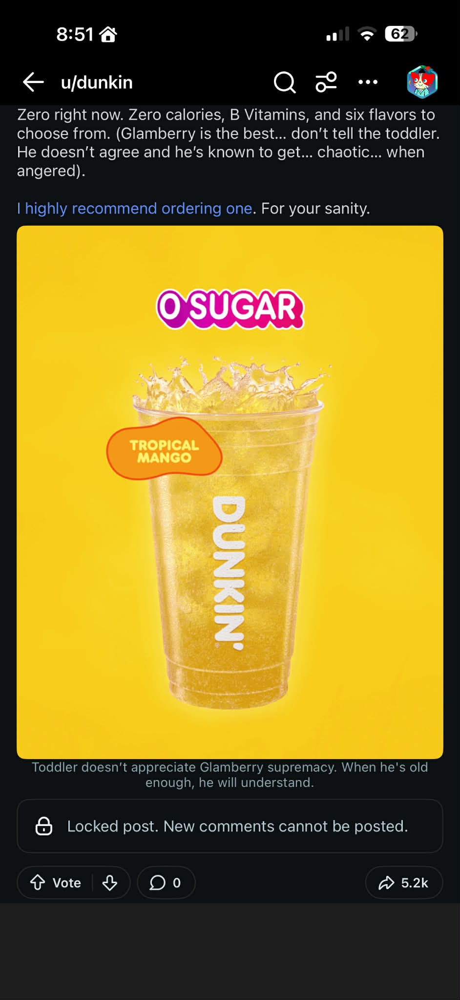
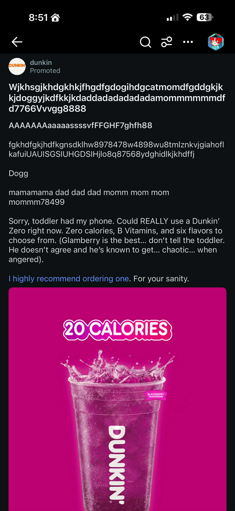
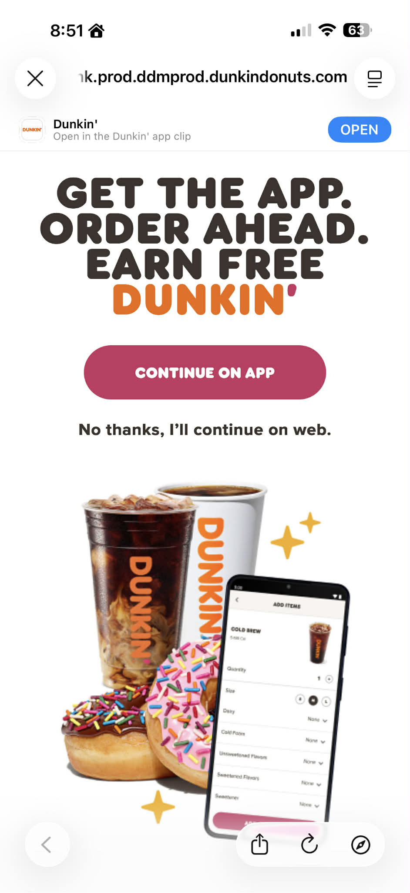

# I Reverse-Engineered Dunkin's Entire Mobile Infrastructure Because Their Reddit Ad Annoyed Me

## The Ad

I'm scrolling Reddit. It's late. I see this:



Fine. A Dunkin' ad. I can ignore a Dunkin' ad. But then I see the *other* one:



Read that text. Read it again. A corporate account — verified, promoted, paid money to put this in my feed — posted this:

```
Wjkhsgjkhdgkhkjfhgdfgdogihdgcatmomdfgddgjkk
kidogsyjkdffkkjkddadadadadadadadamommmmmmmdf
d7766Vvvqg8888
AAAAAAAAAaaaaaasssvIFFGHF7ghfh88
```

Followed by "Sorry, toddler had my phone."

No. No, your toddler did not have your phone. Your *copywriter* had your phone. And I can prove it.

## The Toddler Is a Lie

I ran the "gibberish" through keyboard distribution analysis. If a toddler actually mashed a keyboard, you'd expect roughly equal hits across all three rows — they don't know where the home row is. They're a toddler. They eat crayons.

Here's what the analysis found:

| Keyboard Row | Expected (toddler) | Actual |
|---|---|---|
| Top row (qwerty) | ~33% | **10%** |
| Home row (asdf) | ~33% | **77%** |
| Bottom row (zxcv) | ~33% | **12%** |

**Seventy-seven percent home row.** That's not a toddler. That's a grown adult resting their fingers on asdfghjkl and wiggling them around. The gibberish also contains strategically embedded words:

- `cat` (1x), `dog` (2x), `kid` (1x), `mom` (2x), `dad` (4x), `dada` (4x)

All family-and-pet themed. All placed to make you go "aww that's relatable" instead of "this is an ad." The last line — `mamamama dad dad dad momm mom mom mommm78499` — is so obviously written by a 28-year-old in a WeWork that it hurts.

It's a promoted post designed to look organic. The toddler is a psyop. Dunkin' is running narrative warfare on Reddit and the narrative is "I'm just like you, fellow parent."

## But Then I Clicked It

Against my better judgment, I tapped the ad. The URL was:

```
https://ulink.prod.ddmprod.dunkindonuts.com/dunkin/orders/category/119
```

And I landed here:



Wait. `ulink.prod.ddmprod.dunkindonuts.com`? That's not a normal marketing URL. That's a subdomain four levels deep with what looks like internal environment naming. `prod.ddmprod`? Production inside... another production? What is `ddmprod`?

So I did what any reasonable person would do. I opened a container and started running dig.

## What Is ddmprod?

**ddmprod** stands for **Dunkin' Donuts Mobile Production.** It's their entire internal mobile app platform. The name predates their 2018 rebrand from "Dunkin' Donuts" to just "Dunkin'" — the infrastructure team apparently didn't get the memo. Or didn't care. Either way, the ghost of "Donuts" lives on in their DNS.

Here's the thing about TLS certificates — they have to list every domain they cover. The cert on `ulink.prod.ddmprod.dunkindonuts.com` has a Subject Alternative Names list that reads like someone left the architecture diagram on a public bus:

| Service | What It Does |
|---------|-------------|
| `mapi-dun` | **Mobile API** — the actual app backend. This is the primary CN on the cert. `ulink` is just riding along. |
| `ulink` | **Universal Links** — the thing I clicked. Routes you to the app or the web depending on your device. |
| `ode` | **Order Delivery Engine** — exactly what it sounds like |
| `swi` | Nobody knows. LIVE in prod AND across all dev environments (dev, dlt-dev, dlt-qa, qa). Actively maintained. Prod returns 404 — no default route, not dead. We'll find out. |
| `dun-assets` | Static asset CDN. Serves `dunkin_logo@2x.png` to the app. |
| `cloud` | Only seen in preprod via Wayback. Mysterious. |

All of these exist in both `prod` and `preprod` environments. The whole thing runs on **Akamai CDN** with **DigiCert ECC certificates** issued to **Dunkin' Brands, Inc., Canton, Massachusetts.**

I mapped 56 entities from one drink ad. I know more about Dunkin's mobile backend than most of their employees.

## The Three-Way Split

The `ulink` service is a Node.js/Express app that sniffs your User-Agent and makes a decision:

**If you're on an iPhone with the app installed:** iOS Universal Links kick in. The app opens directly to `dunkin://orders/category/119`. You never see a webpage. You're just suddenly looking at drinks.

**If you're on a phone without the app:** You get the interstitial page (the "GET THE APP" screen I screenshotted). The "Continue on App" button is the good part — it links to:

```
https://dunkin.smart.link/f6iexb4x5?destination=dunkin://orders/category/119
```

`dunkin.smart.link` — that's **Branch.io**, the deep linking vendor. They're the ones who make sure that if you install the app from the App Store, you still land on the right category page. Deferred deep linking. It's actually kind of clever, if you ignore everything else about this situation.

**If you're on a desktop or you're a bot:** HTTP 302 redirect to `www.dunkindonuts.com/en/mobile-app`. Go away, you're not buying a drink from your laptop.

## The Vendor Stack (a.k.a. How Many Companies Does It Take to Sell a Mango Drink)

| Vendor | Role | How I Found It |
|--------|------|----------------|
| **Branch.io** | Deep linking | `dunkin.smart.link` in the landing page HTML |
| **OLO** | Online ordering | `order.dunkindonuts.com` CNAMEs to `whitelabel.olo.com` |
| **CardFree** | Mobile payments / gift cards | Listed in the Apple App Site Association file as `com.cardfree.ddnationalprd` |
| **Akamai** | CDN | CNAME chain: `edgekey.net` → `akamaiedge.net` |
| **Proofpoint** | Email security | MX records, SPF, DMARC. Policy is `p=reject` — at least their email security is tight |
| **DigiCert** | TLS certificates for mobile | ECC SHA384 certs for the ddmprod platform |
| **AWS** | Everything else | Route 53 DNS, Application Load Balancer, ACM certs for the root domain |

Seven vendors to sell you a zero-calorie tropical mango beverage. The `order.dunkindonuts.com` → `whitelabel.olo.com` CNAME was my favorite find. OLO is a restaurant ordering platform. The word "whitelabel" is right there in the DNS. It's like leaving the price tag on a gift.

## Why Was This Ad Targeted at Me?

The Wayback Machine answered this one. Historical snapshots of the `ulink` URLs preserved the full UTM parameters from previous campaigns:

```
utm_source=reddit
utm_medium=paidsocial
utm_campaign=dunkinrun
utm_content=interests
```

The targeting parameter is literally called `interests`. Reddit served me this ad because of my subreddit engagement patterns. Dunkin' paid Reddit to show me a fake toddler post based on an algorithmic guess about what I might enjoy.

Conversion tracking uses Reddit Click IDs (`rdt_cid` parameters) — unique identifiers appended to every ad click URL so Dunkin' can trace the journey from "saw ad on Reddit" to "ordered a drink in the app." There are at least 8 distinct `rdt_cid` values captured in Wayback from different campaign runs. Previous campaigns targeted categories 28, 53, and 70. Mine was 119.

## Bonus Round: The www Certificate

I checked the TLS cert on `www.dunkindonuts.com` for good measure. It lists **47 Subject Alternative Names.** Forty-seven. Including:

- `dev2.dunkindonuts.com`, `qa.dunkindonuts.com`, `qa2.dunkindonuts.com`, `staging.dunkindonuts.com`, `staging3.dunkindonuts.com`, `uat.dunkindonuts.com` — their entire development lifecycle is in this cert
- `ssoprd.dunkindonuts.com`, `social-ssoprd.dunkindonuts.com` — SSO infrastructure
- `menu-pricing-prd.dunkindonuts.com` — the menu pricing API, in production
- `franchiseecentral.dunkinbrands.com` — the franchisee portal
- `www.baskinrobbins.com`, `staging.baskinrobbins.com`, `qa.baskinrobbins.com` — Baskin-Robbins shares the cert

Nothing is exposed or exploitable. But the fact that you can learn the names of all their internal environments from a single `openssl s_client` command is... very Dunkin'.

## The u/dunkin Reddit Account

Created **October 18, 2018** — right when Dunkin' dropped "Donuts" from the name. The account was born with the rebrand. It has 62 link karma and 67 comment karma after 7+ years. The promoted posts don't appear in Reddit's public API because they're served through the ad system, not the user's post history. It's a ghost account that only exists to run paid campaigns.

It is verified. It is a moderator. It has almost no karma. It pretends a toddler typed on its phone to sell you a drink. It is `u/dunkin`.

## Wave 2: I Kept Going

At this point a normal person would have closed the terminal, touched grass, maybe ordered a Dunkin' drink ironically. I ran 7 more containerized probe scripts and discovered 34 additional entities. The investigation now has 56 nodes, 12 clusters, and 21 anomalies. Over a Reddit ad for a mango drink.

### CardFree Builds the Entire App

Remember how I said CardFree handled "mobile payments / gift cards"? I was being generous. The Android Asset Links file on `ulink.prod.ddmprod` lists the app package as `com.cardfree.android.dunkindonuts`. The iOS app's entitlements are under `com.cardfree.ddnationalprd`. The signing key is the same across DEV, UAT, and production builds.

CardFree doesn't just do payments. CardFree IS the app. The Dunkin' app is a CardFree product with Dunkin' branding. The in-app purchases, the ordering flow, the reward scanning — all CardFree. Every time you tap "Order Ahead" you're interacting with a company you've never heard of. Dunkin' is a CardFree customer wearing a costume.

### The Three Generations of Login

I probed every SSO endpoint on `dunkindonuts.com` and found three entirely different authentication systems running simultaneously:

**Generation 1: "ssoprd" (The Fossil)**

The endpoint named "ssoprd" — which you'd think stands for "SSO Production" — is actually a **DD Perks sweepstakes login page.** It serves a 149-byte HTML page that says "Application is running" with Akamai mPulse analytics. Hit `/login` and you get a form asking for your DD Perks email and password to sign into the "Sip. Peel. Win Sweepstakes."

The sweepstakes is long over. The login page is still there. The production SSO endpoint is a dead sweepstakes.

**Generation 2: Spring Authorization Server (The Real One)**

The actual modern auth lives on `social-ssoprd`, `social-ssopreprod`, and `social-ssostg`. These endpoints expose their full OIDC discovery documents — which means I can read their entire authentication architecture from a single `curl`:

- Authorization code flow, client credentials, refresh tokens, device authorization, token exchange
- PKCE with S256, DPoP (Demonstrating Proof-of-Possession), mutual TLS
- Pushed Authorization Requests (PAR)
- One fun inconsistency: the token endpoint is `/oauth/token` (no `2`), but everything else is `/oauth2/`. Someone refactored and missed one.

The 403 on the social-sso root isn't Akamai WAF — it's the application itself. JSESSIONID cookies are set on the 403 response. Java backend. They just don't want you looking at it. The OIDC discovery document, though? Wide open.

**Generation 3: Auth0 (The Experiment)**

`auth0-stg.dunkindonuts.com` CNAMEs to `d-7p5rilj85g.execute-api.us-east-1.amazonaws.com`. An Auth0 staging instance on AWS API Gateway. Someone proposed Auth0 at a meeting once. The DNS record is still here.

Three generations of authentication. One of them is a dead sweepstakes. This is enterprise software.

### QA Bypasses Akamai

Remember the 47-SAN cert with all the development environments? I actually probed those environments. Here's how their SDLC topology works:

| Environment | CDN | IP | Status |
|---|---|---|---|
| www | Akamai e5079 | 23.203.213.158 | Normal |
| dev2 | Akamai e5079 | 23.203.213.158 | Normal |
| **qa** | **NONE** | **44.221.191.180** | **Bare AWS** |
| qa2 | Akamai e5079 | 23.203.213.158 | Normal |
| staging | Akamai (blocked) | 23.203.213.158 | 403 AkamaiGHost |
| staging3 | Akamai e5079 | 23.203.213.158 | Normal |
| **uat** | **NONE** | **216.255.76.18** | **Dead** |

QA goes **directly to AWS.** No CDN. No WAF. No Akamai. And it's using a completely different TLS certificate — an Amazon RSA wildcard (`*.dunkindonuts.com`) instead of the GeoTrust 47-SAN cert that everything else uses. This cert also covers `*.awsprd.dunkindonuts.com`, `*.awsstg.dunkindonuts.com`, and `*.awspt.dunkindonuts.com` — suggesting there's a parallel AWS-native deployment that doesn't use Akamai at all.

QA's error pages helpfully include `Apache Server at qa.dunkindonuts.com Port 80`. Port 80. Over TLS. There's a load balancer in front doing TLS termination, and the backend Apache thinks it's on port 80. Classic.

UAT is even better. `whois 216.255.76.18` comes back as **IBM Cloud Managed Application Services** on the Verizon Business / DIGEX-BLK-2 network. A completely different cloud from everything else. UAT is unreachable — no HTTP, no TLS, nothing. It's a ghost IP on an IBM managed hosting block. This was the pre-AWS world.

### The CAAS Graveyard

Remember `fps.dunkinbrands.com`? The mystery service on an AWS ELB named `caas-prod-dunkinbrands-com`? I found its roommate.

`rbos.dunkinbrands.com` CNAMEs to the exact same ELB. Both dead. All ports closed. The CAAS platform — whatever it was — has been fully decommissioned. Two services, one ELB, zero heartbeats.

And the Genesis platform? `genesisproduction.dunkinbrands.com` and `genesissandbox.dunkinbrands.com` both return NXDOMAIN. Not just dead — removed from DNS entirely. Genesis has been un-created.

### ddmdev: The Secret Twin

CT logs revealed that `ddmprod` has a sibling: **ddmdev** (Dunkin' Donuts Mobile Development). It mirrors the production platform exactly — same services (ulink, mapi-dun, ode, swi), same Akamai edge configuration — but in four development sub-environments: `dev`, `dlt-dev`, `dlt-qa`, and `qa`.

And here's the best part: `swagger.ddmdev.dunkindonuts.com` resolves to **34.237.71.65** — a bare AWS IP with **no CDN in front of it.** Every other service in the entire Dunkin' infrastructure is behind either Akamai or Cloudflare. The Swagger API docs are just... sitting there. On a naked EC2 instance. In production DNS.

I haven't probed what it serves yet. It's the single most interesting door I haven't opened.

### The Menu Pricing API Is a Fortress

`menu-pricing-prd.dunkindonuts.com` is a Spring Boot REST API behind Akamai. I threw everything at it: Spring Boot actuator endpoints (`/actuator`, `/actuator/health`, `/actuator/env`, `/actuator/beans`, `/actuator/mappings`), Swagger paths (`/swagger-ui`, `/v2/api-docs`, `/v3/api-docs`), common API routes (`/api/menu`, `/api/pricing`, `/api/stores`), GraphQL endpoints.

Every. Single. Path. Returns. **401 Unauthorized.**

Spring Security catches the request before it even hits the router. The error JSON is clean — just `{"timestamp":"...","status":401,"error":"Unauthorized","path":"/whatever"}`. No stack traces, no version numbers, no debug info. Identical behavior across `menu-pricing-prd`, `menu-pricing-stg`, and `menu-pricing-prd1` (the redundant instance).

Someone on the Dunkin' platform team actually read the Spring Security documentation. I'm genuinely impressed. This is the most professionally secured service in their entire infrastructure, and it serves menu prices.

### The Vanity Domain Empire

Dunkin' owns a small fleet of vanity domains that all redirect to `dunkindonuts.com`:

| Domain | What It Was | Where It Goes |
|--------|-------------|---------------|
| `dunkinrewards.com` | Rewards program | → `/en/dunkinrewards` |
| `ddperks.com` | Old loyalty program | → `/en/dd-perks` → `/en/dunkinrewards` (double redirect!) |
| `dunkinperks.com` | Also old loyalty | → `/content/dunkindonuts/en/responsive/ddperks/splashpage.html` → chain of 3 more redirects |
| `dunkinemail.com` | Email signup | → `/content/dunkindonuts/en/responsive/dunkin_email.html` → dd-perks registration → dunkinrewards registration → **403** |
| `dunkinrun.com` | Campaign domain | → `/content/dunkindonuts/en.html` → `/en` |
| `ddglobalfranchising.com` | Franchising (old) | → `global.dunkinfranchising.com/en` |
| `dunkinfranchising.com` | Franchising | → `franchising.inspirebrands.com/dunkin` |
| `dunkinnation.com` | Dunkin' Nation | HTTPS dead, HTTP redirects to itself forever |

`dunkinemail.com` is the champion. It goes through FIVE redirects: the apex domain, then www, then a legacy CMS path, then dd-perks registration, then dunkin rewards registration, and finally lands on a **403 Forbidden.** You can't even sign up for their email list via their email signup domain. The redirect chain is a fossil record of three rebrands.

The TLS certs on these vanity domains revealed two previously unknown domains: **`clubdunkin.com`** and **`*.dunkindonuts.co.uk`** (they have a UK domain!). A different cert on `dunkinnation.com` covers **`*.dnkn.com`** and **`*.lsmnow.com`** — two domains I've never seen mentioned anywhere. The investigation continues.

### The Full Vendor Census

By Wave 2 the vendor list has grown considerably:

| Vendor | What They Do for Dunkin' |
|--------|-------------------------|
| Branch.io | Deep linking |
| OLO | Online ordering (Dunkin') |
| Tillster | Online ordering (Baskin-Robbins, different vendor!) |
| CardFree | THE ENTIRE MOBILE APP |
| Akamai | CDN + WAF |
| Cloudflare | CDN for franchisee portal + login |
| Proofpoint | Email security |
| DigiCert / GeoTrust | TLS certs |
| AWS | Everything that isn't on something else |
| Microsoft Azure | International site (just that one) |
| IBM Cloud | UAT (dead) |
| IPR Software | Investor relations site |
| ServiceNow | Customer chat (`inspirecustomer.service-now.com`) |
| Paradox AI | Recruiting / careers |
| Adobe Analytics | Web analytics (Omniture) |
| Salesforce Marketing Cloud | Email marketing |
| WeRecognize | Employee recognition |

**Seventeen vendors.** To sell donuts. And mango drinks. The international site runs on Azure — a completely different cloud from everything else — because apparently "international" means "different everything." The employee recognition platform is literally called WeRecognize. I can't make this up.

## Methodology

All probes ran inside containerized environments (`podman run --rm --dns 8.8.8.8 investigator`). DNS enumeration, HTTP redirect tracing, TLS certificate inspection, certificate transparency log queries, Wayback Machine CDX queries, Apple App Site Association file retrieval, Reddit public API, iTunes Search API, nmap port scanning, Spring Boot actuator probing, OIDC discovery endpoint enumeration. 17 probe scripts across 2 waves. Zero exploitation, zero auth bypass, zero interaction with any service beyond reading what they publicly serve.

I just looked at what was already there. Dunkin' made it easy.

## Files

- **[GRAPH.md](GRAPH.md)** — The serious version. 56 entities, 12 clusters, 21 anomalies. Structured for machines.
- **`intake-2026-04-13/`** — The evidence. Screenshots and the URL that started all of this.
- **`artifacts/`** — Raw probe output from 17 artifact directories. DNS, HTTP, certs, OSINT, CT logs, SSO discovery, menu pricing API, QA environments, legacy services, vanity domains.
- **`scripts/`** — 17 reproducible probe scripts. Run them yourself. Everything is containerized.
